# nx_ui

This package provides ui widgets.

## Features

UI widgets provided in package:

- nxCustomDrawer
- nxBackgroundCard
- nxBackgroundImage
- nxEmptyScreen
- nxSearchTextField
- nxComingSoon
- nxExpandableText
- nxPrimaryButton
- nxSecondaryButton
- nxShimmerBox
- nxSnackbar
- nxTile

## Getting started

Add the package to pubspec:

```yaml
nx_ui:
  git:
    url: https://github.com/sequrify-io/nx_ui.git
    ref: v0.0.9
```

## Usage and description of widgets

### nxCustomDrawer

Drawer widget.

<p>
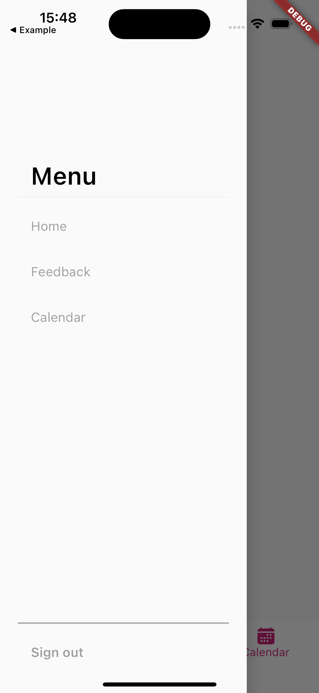

</p>
Example usage:

```dart
import 'package:nx_ui/widgets/nxCustomDrawer.dart';

...
  drawer: NxCustomDrawer(
        drawerOptions: {
          'Home': () => {
                context.goNamed(
                  'home',
                  pathParameters: {
                    'tab': '0',
                  },
                ),
              },
          'Feedback': () => {
                context.goNamed(
                  'home',
                  pathParameters: {
                    'tab': '1',
                  },
                ),
              },
          'Calendar': () => {
                context.goNamed(
                  'home',
                  pathParameters: {
                    'tab': '2',
                  },
                ),
              },
        },
        withSignOutOption: false,
      ),
```

You have to provide one required parameter:
final Map<String, Function> drawerOptions - map with drawer options names as keys and navigation Functions as values.

Additionally you can provide parameters:

final EdgeInsets? padding;
final DrawerHeader? drawerHeader;
final TextStyle? optionTextStyle;
final bool withSignOutOption - default true.
final Function? signOutFunction - function invoked after clicking sign out.
final TextStyle? signOutTextStyle;

### nxBackgroundCard

Resizable background card widget, adjustable to the screen. It goes well with Stack widget.

<p>
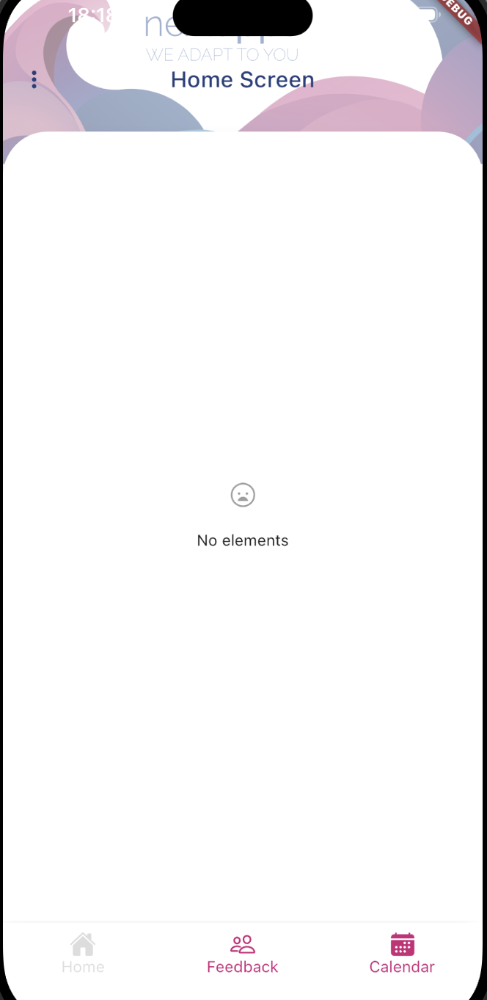
</p>

Example usage:

```dart
...
child: NxBackgroundCard(
                  height: 0.76,
                  child:  nxEmptyScreen(
                      context,
                      const Text('No elements'),
                      Colors.white,

                  ),
                ),
...
```

NxBackgroundCard takes 7 parameters:

- final Widget child
- final double? height
- final double? width
- final Color? backgroundColor
-  final EdgeInsetsGeometry? margin;
-  final double? elevation;
-  final ShapeBorder? shape;

### nxBackgroundImage

Container widget that works as a background image.

<p>

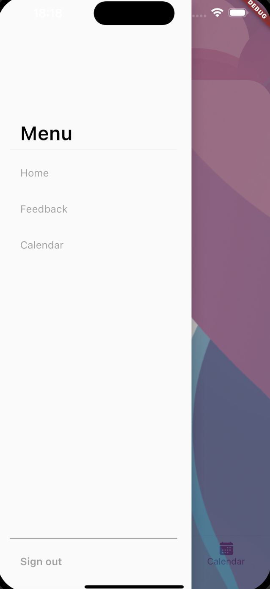
</p>

Example usage:

```dart
@override
  Widget build(BuildContext context) {
    return nxBasicScreen(
      appContext: context,
      isFullScreen: true,
      extendBodyBehindAppBar: true,
      appBarBackgroundColor: Colors.transparent,
      body: Center(
        child: Stack(
            children: [
              const NxBackgroundImage(
                imagePath: "assets/images/nextapps_logo.png",
                imageShift: 295,
                opacity: 0.5,
              ),
              Positioned(
                bottom: 0,
                child: NxBackgroundCard(
                  context: context,
                  height: 0.76,
                  child:
                    child: nxEmptyScreen(
                      context,
                      const Text('No elements'),
                      Colors.white,

                  ),
                ),
              ),
            ],

        ),)
        ...
    )}
```

It takes 3 parameters:

final String imagePath - path to the image
final double imageShift - distance from the bottom of the stack
final double opacity - image opacity

### nxEmptyScreen

Empty customizable widget that can be used e.g. when there's no elements returned in list or grid view.

<p>

</p>

Example usage:

```dart
...
NxBackgroundCard(
                  context: context,
                  height: 0.76,
                  child: nxEmptyScreen(
                    context,
                    const Text('No elements'),
                    Colors.white,
                  ),
                ),
```

It takes 3 parameters:

- Text information - text displayed inside container
- Color color - color of the container
- IconData? icon - icon displayed inside container
- double? height - height of the container
- double? width - width of the container

### nxSearchTextField

Search field widget.

<p>
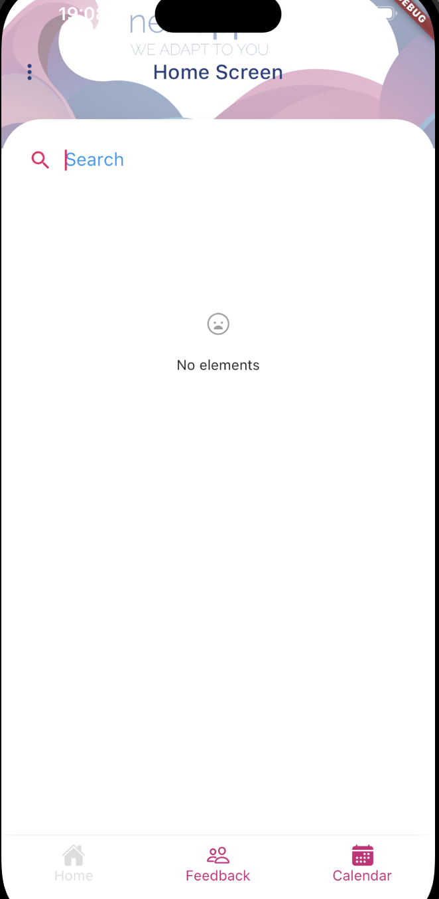
</p>

Example usage:

```dart
...
 Padding(
                      padding: const EdgeInsets.symmetric(horizontal: 15.0),
                      child: NxSearchTextField(
                        onChanged: (value) {
                          searchString = value.toLowerCase();
                        },
                      ),
                    ),
```

It takes parameters:

final Function(String)? onChanged - function invoked after text field changes
final bool readOnly - indicator if the field is read only or not
final String? searchText - String displayed inside field
final Color? cursorColor - cursor color
final Color? fillColor - text field color
final TextStyle? labelStyle - text field text style
final TextStyle? hintStyle - text field hint text style
final Widget? prefixIcon - custom icon widget

### nxComingSoon

This widget can be used as a preview of some features.
Example usage:

```dart
...
  @override
  Widget build(BuildContext context, WidgetRef ref) {
    return const Scaffold(
      body: nxComingSoonPanel(text: 'More info available soon', comingSoonTitle: 'Coming soon'),
    );
  }

```

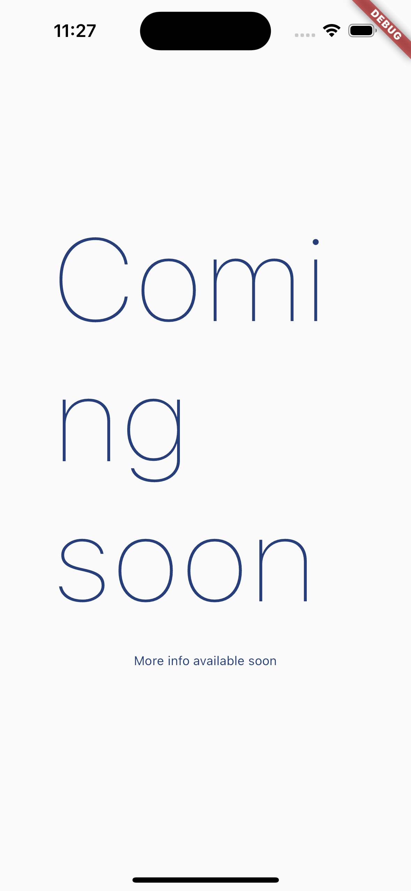

You have to provide two required parameters:

- required String text - lower text visible on screen
- required String comingSoonTitle - upper text visible on screen

The other parameters you can provide are:

- SvgPicture? svg - svg visible above title text
- TextStyle? textStyleTitle - text style of title text
- TextStyle? textStyleBody - text style of lower text

### nxExpandableText

This widget can be used when you have a long text and you want to have an option to show dialog to display whole text on scrollable.
Example usage:

```dart
...
  @override
  Widget build(BuildContext context, WidgetRef ref) {
    return const Scaffold(
      body: Center(
        child: Column(
          children: [
            SizedBox(
              height: 100,
            ),
            nxExpandableText(text: 'hellesdfdsfdsfsdffdsdddddddjvfjfdvhfbdjdnfvcdskvjidusbvhdskfncjbdfvdnvkdsmcksdmckdmscjdnvsdvnidsjvdsmkbkmcksmdcjdsbfcdkcmdsjustynadn dsjnfsocmskdfo', buttonText: 'Read more')
          ],
        ),
      ),
    );
  }

```

<p float="left">
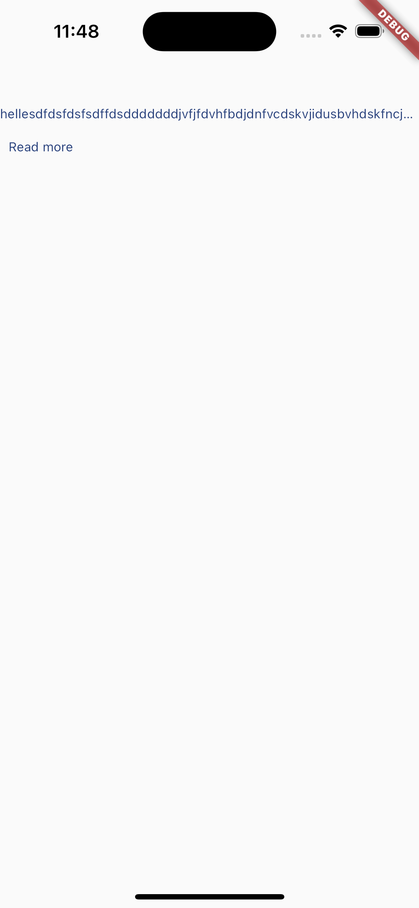

</p>

You have to provide to widget two required parameters:

- required String text - text visible on screen
- required String buttonText - text that invokes dialog after tapping

The other parameters you can provide are:

- Image? icon - your own icon used for closing the dialog that would replace the default icon
- TextStyle? dialogTextStyle - text style inside dialog
- TextStyle? textStyle - text style of text on screen
- TextStyle? buttonTextStyle - text style of button text on screen
- Color? backgroundColor - background color of dialog
- int maxLines - by default it is set to 1, number of lines that can be visible on screen

### nxPrimaryButton

This widget can be used as a button.
Example usage:

```dart
...
  @override
  Widget build(BuildContext context, WidgetRef ref) {
    return Scaffold(
      backgroundColor: Colors.lightBlue,
      body: Center(
        child: Column(
          children: [
            const SizedBox(
              height: 100,
            ),
            nxPrimaryButton(onPressed: () {}, labelText: 'Button')
          ],
        ),
      ),
    );
  }

```


You have to provide to widget two required parameters:

- required void Function() onPressed - function that will be invoked after clicking the button
- required String labelText - text displayed on button

The other parameters you can provide are:

- dynamic Function(bool)? onHighlightChanged
- MouseCursor? mouseCursor
- ButtonTextTheme? textTheme
- Color? disabledTextColor
- Color? disabledColor
- Color? focusColor
- Color? hoverColor
- Color? highlightColor
- Color? splashColor
- Brightness? colorBrightness
- double? elevation
- double? focusElevation
- double? hoverElevation
- double? highlightElevation
- double? disabledElevation
- EdgeInsetsGeometry? padding
- VisualDensity? visualDensity
- ShapeBorder? shape
- FocusNode? focusNode
- MaterialTapTargetSize? materialTapTargetSize
- Duration? animationDuration
- double? minWidth
- double? height
- void Function()? onLongPress
- Image? image - image that can replaced white arrow icon
- Color? textColor
- TextStyle? textStyle
- bool? imageEnabled - by default set to true. Set to false if you don't want to display image on button;
- Color? imageColor;

The button is based on MaterialButton, so those are all parameters that MaterialButton takes.

### nxSecondaryButton

This widget can be used as a button. This button has a gradient inside.
Example usage:

```dart
...
 @override
  Widget build(BuildContext context, WidgetRef ref) {
    return Scaffold(
      backgroundColor: Colors.lightBlue,
      body: Center(
        child: Column(
          children: [
            const SizedBox(
              height: 100,
            ),
            nxSecondaryButton(
              onPressed: () {},
              labelText: 'Button',
              textColor: Colors.white,
            )
          ],
        ),
      ),
    );
  }

```

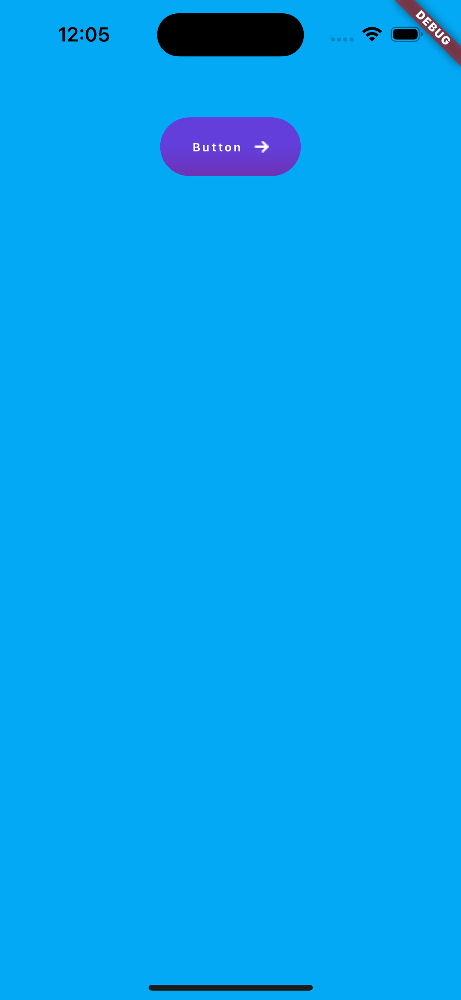

You have to provide to widget two required parameters:

- required void Function() onPressed - function that will be invoked after clicking the button
- required String labelText - text displayed on button

The other parameters you can provide are:

- dynamic Function(bool)? onHighlightChanged
- MouseCursor? mouseCursor
- ButtonTextTheme? textTheme
- Color? disabledTextColor
- Color? disabledColor
- Color? focusColor
- Color? hoverColor
- Color? highlightColor
- Color? splashColor
- Brightness? colorBrightness
- double? elevation
- double? focusElevation
- double? hoverElevation
- double? highlightElevation
- double? disabledElevation
- EdgeInsetsGeometry? padding
- VisualDensity? visualDensity
- ShapeBorder? shape
- FocusNode? focusNode
- MaterialTapTargetSize? materialTapTargetSize
- Duration? animationDuration
- double? minWidth
- double? height
- void Function()? onLongPress
- Image? image - image that can replaced white arrow icon
- LinearGradient? linearGradient - custom gradient instead of a default one.
- Color? textColor
- TextStyle? textStyle
- bool? imageEnabled - by default set to true. Set to false if you don't want to display image on button;
- Color? imageColor;

### nxShimmerBox

This widget provides a shimmer animation and it can be displayed during loading.

Example usage:

```dart
...
 @override
  Widget build(BuildContext context, WidgetRef ref) {
    return const Scaffold(body: nxShimmerBox());
  }

```

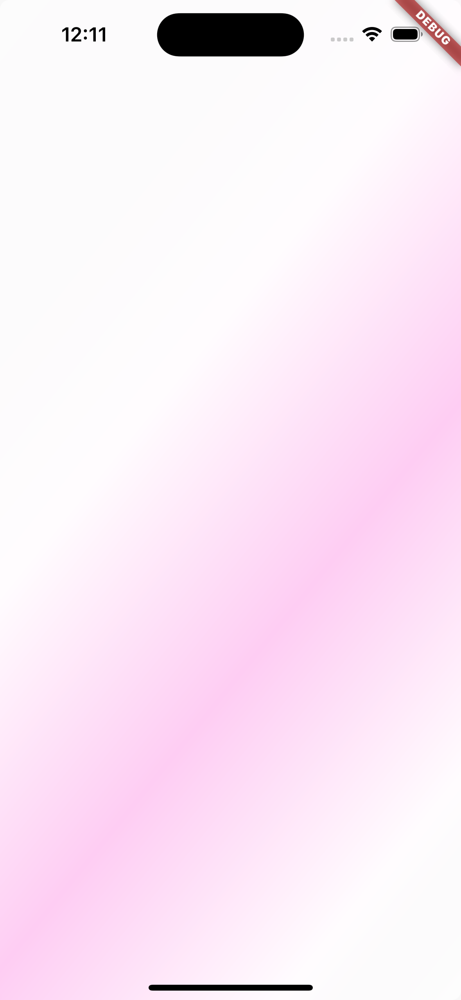

Parameters you can provide are:

- double width - width of container with shimmer, by default infinity
- double height - height of container with shimmer, by default infinity
- double opacity - opacity of shimmer, by default 1
- Color? color - color of shimmer

### nxCustomSnackbar

This widget provides a custom snackbar.

<p>
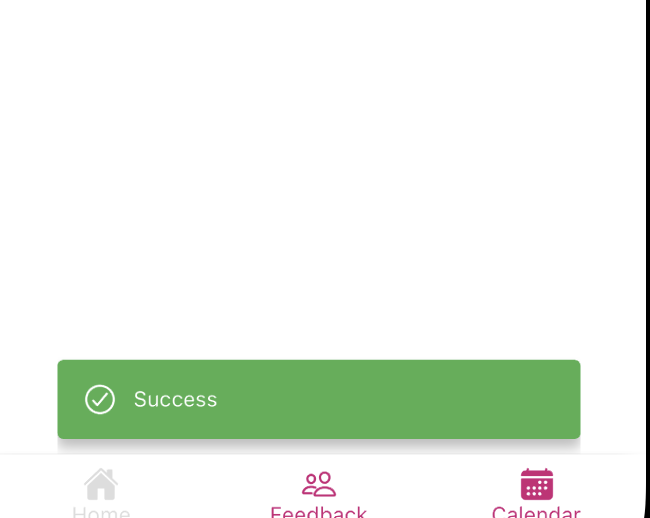
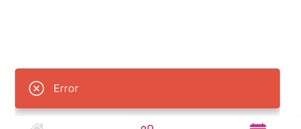
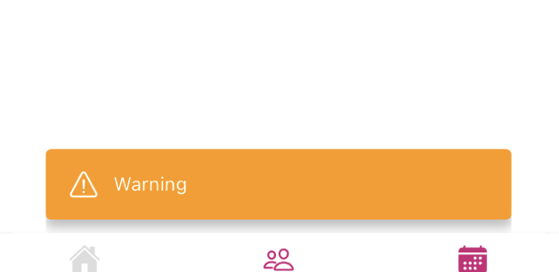
</p>

There are three types of snackbar defined:

- success
- error
- warning

You can use showSuccessSnackBar, showErrorSnackBar, and showWarningSnackbar.

Here is example usage:

```dart
...
 nxPrimaryButton(
                      imageColor: Colors.black,
                      onPressed: () {
                        NxCustomSnackBar.showErrorSnackBar(context: context, message: 'Error');
                      },
                      labelText: 'Invoke snackbar',
                    ),

```

You can also customize it to your own type using showCustomSnackBar function.

For parameters you provide:

required BuildContext context - context
required String message - snackbar message
required Color color - snackbar color
IconData? icon - icon on snackbar
int seconds - how long snackbar displays

### nxTile

This widget provides a tile component.
Example usage:

```dart
...
  @override
  Widget build(BuildContext context, WidgetRef ref) {
    return const Scaffold(
      body: Center(
        child: Column(
          children: [
            SizedBox(
              height: 100,
            ),
            nxTile(
              color: Colors.black,
              text: Text(
                'Hello',
                style: TextStyle(color: Colors.white),
              ),
            ),
          ],
        ),
      ),
    );
  }

```

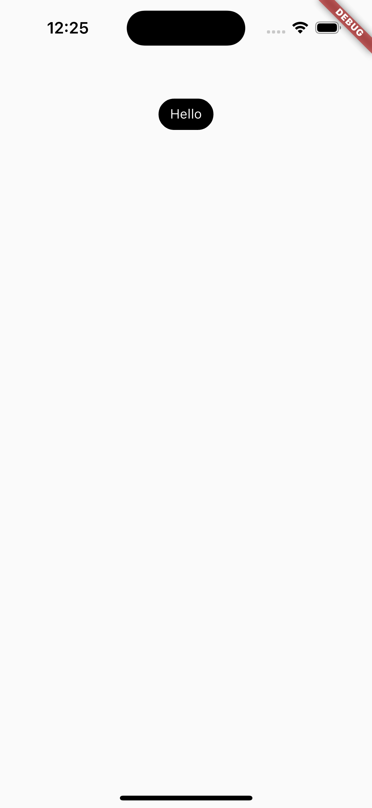

The tile's measurments adjust along with added text.

Parameters you can provide:

- Color? color - color of a tile, default is white
- Text? text - Text widget inside a tile

## Bugs & features

If you found bug or need a feature add issue on Github or make a PR.
