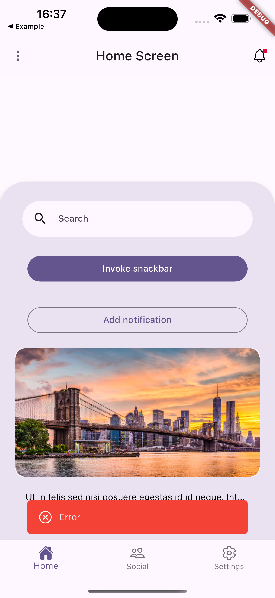

# nx_ui

A Flutter package providing a collection of customizable widgets for building modern user interfaces. Features include drawers, cards, buttons, search fields, and various utility widgets with flexible styling options.

## Table of Contents
- [Features](#features)
- [Requirements](#requirements)
- [Getting Started](#getting-started)
- [Widgets](#widgets)
  - [nx_drawer](#nx_drawer)
  - [nx_navigation_drawer](#nx_navigation_drawer)
  - [nx_background_card](#nx_background_card)
  - [nx_background_layer](#nx_background_layer)
  - [nx_empty_screen](#nx_empty_screen)
  - [nx_search_text_field](#nx_search_text_field)
  - [nx_coming_soon_widget](#nx_coming_soon_widget)
  - [nx_expandable_text](#nx_expandable_text)
  - [nx_primary_button](#nx_primary_button)
  - [nx_secondary_button](#nx_secondary_button)
  - [nx_shimmer_box](#nx_shimmer_box)
  - [nx_snackbar](#nx_snackbar)
  - [nx_photo_card](#nx_photo_card)

## Features

UI widgets provided in package:

- nx_drawer - Customizable drawer with navigation and sign-out support
- nx_navigation_drawer - Material 3 style navigation drawer with destination support
- nx_background_card - Card widget that sizes relative to screen dimensions
- nx_background_layer - Container for background images or colors
- nx_empty_screen - Empty state widget with icon and message
- nx_search_text_field - Material 3 search field with state-based styling
- nx_coming_soon_widget - Placeholder for upcoming features
- nx_expandable_text - Text widget that expands into a dialog
- nx_primary_button - Filled button using FilledButton
- nx_secondary_button - Outlined button using OutlinedButton
- nx_shimmer_box - Loading placeholder with shimmer animation
- nx_snackbar - Snackbar with predefined styles (error, success, warning)
- nx_photo_card - Card for displaying images with fallback

## Requirements

- Dart SDK: >=3.0.1 <4.0.0
- Flutter SDK: >=1.17.0

## Getting Started

Add the package to pubspec:

```yaml
nx_ui:
  git:
    url: https://github.com/sequrify-io/nx_ui.git
    ref: v0.0.19
```

## Widgets

### nx_drawer

A customizable drawer with support for navigation options and an optional sign-out button.
Uses Flutter's standard [Drawer] widget with enhanced functionality.

Example usage:

```dart
import 'package:nx_ui/widgets/nx_drawer.dart';
import 'package:flutter/material.dart';

Drawer(
  child: NxCustomDrawer(
    drawerOptions: {
      [
        'Profile',
        Icon(Icons.person_outline),  // Icon is optional
      ]: () {
        // Handle profile navigation
      },
      [
        'Settings',
        Icon(Icons.settings_outline),
      ]: () {
        // Handle settings navigation
      },
    },
    // Optional: Custom sign out handling
    withSignOutOption: true,
    signOutFunction: () {
      // Handle sign out
    },
    // Optional: Custom styling
    backgroundColor: Colors.white,
    optionTextStyle: TextStyle(fontSize: 16),
  ),
)
```

#### Parameters

Required:
- `drawerOptions`: Map<List<dynamic>, Function()> - Navigation options where:
  - Key is a list containing:
    - First element (String): The option text
    - Second element (optional Widget): Icon to display next to the text
  - Value is a callback function executed when the option is tapped

Optional:
- `padding`: EdgeInsets? - Drawer content padding (default: EdgeInsets.all(22))
- `drawerHeader`: DrawerHeader? - Custom header (default: "Menu" text in headlineMedium style)
- `optionTextStyle`: TextStyle? - Text style for navigation options
- `withSignOutOption`: bool - Show sign out option (default: true)
- `signOutFunction`: Function()? - Callback when sign out is tapped
- `signOutTextStyle`: TextStyle? - Text style for sign out option
- `signOutIcon`: Widget? - Custom sign out icon (default: package's logout_icon.svg)
- `sequrifyButton`: Widget? - Optional widget shown at bottom of drawer
- `backgroundColor`: Color? - Drawer background color
- `drawerWidth`: double? - Drawer width
- `elevation`: double? - Drawer elevation

#### Default Behavior
- Shows a header with "Menu" text in headlineMedium style
- Includes a sign out option at the bottom (unless disabled)
- Automatically closes when any option is selected
- Icons in navigation options are optional
- Uses package's logout_icon.svg for sign out by default

### nx_navigation_drawer

Modern navigation drawer with support for destinations and sign-out functionality.


Example usage:

```dart
import 'package:nx_ui/widgets/nx_navigation_drawer.dart';
import 'package:nx_ui/models/destination.dart';
import 'package:flutter_svg/flutter_svg.dart';

const drawerDestinations = <Destination>[
  Destination('Profile', Icon(Icons.person_2_outlined), Icon(Icons.person_2)),
  Destination('Notifications', Icon(Icons.notifications_outlined), Icon(Icons.notifications)),
  Destination('Settings', Icon(Icons.settings_outlined), Icon(Icons.settings)),
];

NxCustomNavigationDrawer(
  sequrifyButton: TextButton(
    onPressed: () {},
    child: const Text('Custom Action'),
  ),
  destinations: drawerDestinations,
  signOutDestination: Destination(
    'Sign out',
    SvgPicture.asset(
      'assets/logout_icon.svg',
      package: 'nx_ui',
    ),
    SvgPicture.asset(
      'assets/logout_icon.svg',
      package: 'nx_ui',
    ),
  ),
  onDestinationSelected: (int index) {
    context.goNamed(
      'home',
      pathParameters: {
        'tab': '$index',
      },
    );
  },
  selectedIndex: currentTab,
),
```

#### Parameters

Required:
- `destinations`: List<Destination> - List of Destination objects to display in drawer

Optional:
- `onDestinationSelected`: Function(int)? - Callback when destination is selected
- `selectedIndex`: int? - Currently selected destination index
- `signOutDestination`: Destination? - Sign out destination configuration
- `headerTextStyle`: TextStyle? - Text style for header
- `optionTextStyle`: TextStyle? - Text style for options
- `sequrifyButton`: Widget? - Custom button widget
- `backgroundColor`: Color? - Background color of drawer
- `elevation`: double? - Drawer elevation
- `shadowColor`: Color? - Shadow color
- `surfaceTintColor`: Color? - Surface tint color
- `indicatorColor`: Color? - Selected item indicator color
- `indicatorShape`: ShapeBorder? - Shape of the selection indicator

### nx_background_card

Resizable background card widget, adjustable to the screen. It goes well with Stack widget.


Example usage:

```dart
Stack(
  children: [
    NxBackgroundLayer(
      backgroundColor: Colors.black.withOpacity(0.3),
    ),
    Positioned(
      bottom: 0,
      child: NxBackgroundCard(
        height: 0.5,
        elevation: 20,
        child: Column(
          mainAxisSize: MainAxisSize.max,
          mainAxisAlignment: MainAxisAlignment.start,
          crossAxisAlignment: CrossAxisAlignment.start,
          children: [
            NxEmptyScreen(
              height: 350,
              context: context,
              information: const Text('No elements'),
              color: Colors.white,
            ),
            Row(
              mainAxisSize: MainAxisSize.max,
              mainAxisAlignment: MainAxisAlignment.start,
              crossAxisAlignment: CrossAxisAlignment.start,
              children: [
                const Spacer(),
                NxSecondaryButton(
                  text: "Cancel",
                  onPressed: () {},
                  buttonWidth: 155,
                  buttonHeight: 50,
                ),
                const Spacer(),
                NxPrimaryButton(
                  text: "Add",
                  onPressed: () {},
                  buttonWidth: 155,
                  buttonHeight: 50,
                ),
                const Spacer(),
              ],
            ),
          ],
        ),
      ),
    ),
  ],
)
```

#### Parameters

Required:
- `child`: Widget - The content of the card

Optional:
- `height`: double? - Height of the card as a fraction of screen height
- `width`: double? - Width of the card as a fraction of screen width
- `backgroundColor`: Color? - Background color of the card
- `margin`: EdgeInsetsGeometry? - Margin around the card
- `elevation`: double? - Card elevation
- `shape`: ShapeBorder? - Shape of the card
- `isScrollable`: bool - Whether the content is scrollable (default: false)

### nx_background_layer

Container widget that works as a background image or color layer.


Example usage:

```dart
Stack(
  children: [
    GestureDetector(
      onTap: () => context.pop(),
      child: Stack(
        children: [
          NxBackgroundLayer(
            backgroundColor: Colors.black.withOpacity(0.2),
          ),
        ],
      ),
    ),
    NxCustomDrawer(...)
  ]
)
```

#### Parameters

Optional:
- `fromAssets`: bool - Whether to load image from assets (default: true)
- `imagePath`: String? - Path to the image
- `imageShift`: double - Distance from the bottom of the stack (default: 0.0)
- `imageOpacity`: double - Image opacity (default: 1.0)
- `backgroundColor`: Color? - Background color when not using image

### nx_empty_screen

Empty customizable widget that can be used when there's no content to display.


Example usage:

```dart
NxEmptyScreen(
  context: context,
  information: const Text('No elements'),
  color: Colors.white,
  height: 350,
)
```

#### Parameters

Required:
- `context`: BuildContext - Build context
- `information`: Text - Text displayed inside container

Optional:
- `color`: Color? - Color of the container
- `icon`: IconData? - Icon displayed inside container (default: Ionicons.sad_outline)
- `height`: double? - Height of the container
- `width`: double? - Width of the container

### nx_search_text_field

A Material 3 search field with support for different visual states and custom styling.


Example usage:

```dart
import 'package:nx_ui/widgets/nx_search_text_field.dart';
import 'package:flutter/material.dart';

NxSearchTextField(
  onChanged: (value) {
    // Handle search text changes
  },
  onSubmitted: (value) {
    // Handle search submission
  },
  hintText: 'Search items...',
  fillColor: const WidgetStatePropertyAll<Color>(Colors.grey),
  trailing: [
    IconButton(
      icon: Icon(Icons.clear),
      onPressed: () {
        // Clear search
      },
    ),
  ],
)
```

#### Parameters

Optional:
- `onChanged`: Function(String)? - Called when search text changes
- `onSubmitted`: Function(String)? - Called when search is submitted
- `onTap`: Function()? - Called when field is tapped
- `fillColor`: WidgetStateProperty<Color?>? - Background color for different states
- `textStyle`: WidgetStateProperty<TextStyle?>? - Text style for different states
- `hintStyle`: WidgetStateProperty<TextStyle?>? - Hint text style for different states
- `hintText`: String? - Placeholder text (default: "Search")
- `controller`: TextEditingController? - For controlling the text input
- `focusNode`: FocusNode? - For controlling focus
- `width`: double? - Field width
- `height`: double? - Field height
- `elevation`: WidgetStatePropertyAll<double>? - Elevation for different states
- `trailing`: Iterable<Widget>? - Widgets to show after the search icon
- `side`: WidgetStateProperty<BorderSide?>? - Border style for different states
- `shape`: WidgetStateProperty<OutlinedBorder?>? - Field shape for different states

### nx_coming_soon_widget

Widget for displaying a "coming soon" message with optional icon. Also provides a panel version (`NxComingSoonPanel`) that wraps the widget in a full-screen scaffold.


Example usage:

```dart
// Basic widget
NxComingSoonWidget(
  text: 'More info available soon',
  comingSoonTitle: 'Coming soon',
)

// Full screen panel
NxComingSoonPanel(
  text: 'More info available soon',
  comingSoonTitle: 'Coming soon',
)
```

#### Parameters

Required:
- `text`: String - Lower text visible on screen
- `comingSoonTitle`: String - Upper text visible on screen

Optional:
- `svg`: SvgPicture? - SVG image displayed above title
- `textStyleTitle`: TextStyle? - Text style for title
- `textStyleBody`: TextStyle? - Text style for description

### nx_expandable_text

Widget for displaying truncated text with an option to expand it in a dialog.


Example usage:

```dart
NxExpandableText(
  text: 'This is a long text that will be truncated...',
  buttonText: 'Read more',
  maxLines: 2,
)
```

#### Parameters

Required:
- `text`: String - Text to display
- `buttonText`: String - Text for the expand button

Optional:
- `maxLines`: int - Number of lines to show before truncating (default: 1)
- `icon`: Image? - Custom icon for closing the dialog
- `dialogTextStyle`: TextStyle? - Text style for dialog content
- `textStyle`: TextStyle? - Text style for main text
- `buttonTextStyle`: TextStyle? - Text style for button
- `backgroundColor`: Color? - Background color of dialog

### nx_primary_button and nx_secondary_button

Customizable filled and outlined buttons with flexible styling options.


Example usage:

```dart
NxPrimaryButton(
  text: "Submit",
  onPressed: () {
    // Handle button press
  },
  buttonWidth: 155,
  buttonHeight: 50,
)

NxSecondaryButton(
  text: "Cancel",
  onPressed: () {
    // Handle button press
  },
  buttonWidth: 155,
  buttonHeight: 50,
)
```

#### Parameters

Required:
- `text`: String - Button text
- `onPressed`: VoidCallback - Function to call when button is pressed

Optional:
- `margin`: EdgeInsetsGeometry? - Button margin
- `buttonTextStyle`: TextStyle? - Text style for button text
- `buttonWidth`: double? - Width of button
- `buttonHeight`: double? - Height of button
- `buttonStyle`: ButtonStyle? - Custom button style

### nx_shimmer_box

A loading placeholder widget with shimmer animation effect.

Example usage:

```dart
import 'package:nx_ui/widgets/nx_shimmer_box.dart';
import 'package:flutter/material.dart';

// Basic shimmer box with default size
NxShimmerBox()

// Custom sized shimmer box with specific color and opacity
NxShimmerBox(
  width: 200,
  height: 100,
  opacity: 0.8,
  color: Colors.grey[300],
)

// Loading card with shimmer effect
Card(
  child: Padding(
    padding: EdgeInsets.all(16),
    child: Column(
      children: [
        NxShimmerBox(
          height: 24,
          width: double.infinity,
        ),
        SizedBox(height: 8),
        NxShimmerBox(
          height: 100,
          width: double.infinity,
        ),
      ],
    ),
  ),
)
```

#### Parameters

Optional:
- `width`: double - Width of the shimmer box (default: double.infinity)
- `height`: double - Height of the shimmer box (default: double.infinity)
- `opacity`: double - Opacity of the shimmer effect (default: 1)
- `color`: Color? - Background color of the box

### nx_snackbar

A utility class providing snackbar notifications with predefined styles.



Example usage:

```dart
// Show an error snackbar
NxCustomSnackBar.showErrorSnackBar(
  context: context,
  message: 'An error occurred'
);

// Show a success snackbar
NxCustomSnackBar.showSuccessSnackBar(
  context: context,
  message: 'Operation completed successfully'
);

// Show a warning snackbar
NxCustomSnackBar.showWarningSnackBar(
  context: context,
  message: 'Please review your input'
);

// Show a custom snackbar
NxCustomSnackBar.showCustomSnackBar(
  context: context,
  message: 'Custom message',
  color: Colors.purple,
  icon: Icons.star,
  seconds: 5,
  snackBarBehavior: SnackBarBehavior.fixed,
);
```

#### Methods

- `showErrorSnackBar`: Shows a red snackbar with an error icon
- `showSuccessSnackBar`: Shows a green snackbar with a checkmark icon
- `showWarningSnackBar`: Shows an orange snackbar with a warning icon
- `showCustomSnackBar`: Shows a customizable snackbar

#### Parameters for showCustomSnackBar

Required:
- `context`: BuildContext - The build context
- `message`: String - The text to display
- `color`: Color - Background color of the snackbar

Optional:
- `icon`: IconData? - Optional icon to show before the message
- `seconds`: int - Duration in seconds (default: 2)
- `snackBarBehavior`: SnackBarBehavior - Whether the snackbar floats or is fixed (default: floating)

### nx_photo_card

A card widget for displaying images with fallback placeholder.

Example usage:

```dart
import 'package:nx_ui/widgets/nx_photo_card.dart';
import 'package:flutter/material.dart';

// Basic photo card with asset image
NxPhotoCard(
  imagePath: 'assets/images/photo.jpg',
  height: 200,
  width: double.infinity,
  elevation: 4,
)

// Photo card with custom child widget
NxPhotoCard(
  height: 200,
  width: double.infinity,
  elevation: 2,
  child: Image.network(
    'https://example.com/image.jpg',
    fit: BoxFit.cover,
  ),
)

// Photo card without image (shows placeholder)
NxPhotoCard(
  height: 150,
  width: 200,
  elevation: 1,
)
```

#### Parameters

Optional:
- `imagePath`: String? - Path to the asset image
- `elevation`: double? - Card elevation (default: 0)
- `child`: Widget? - Custom widget to display instead of image
- `height`: double? - Card height (default: 200)
- `width`: double? - Card width (default: double.infinity)
