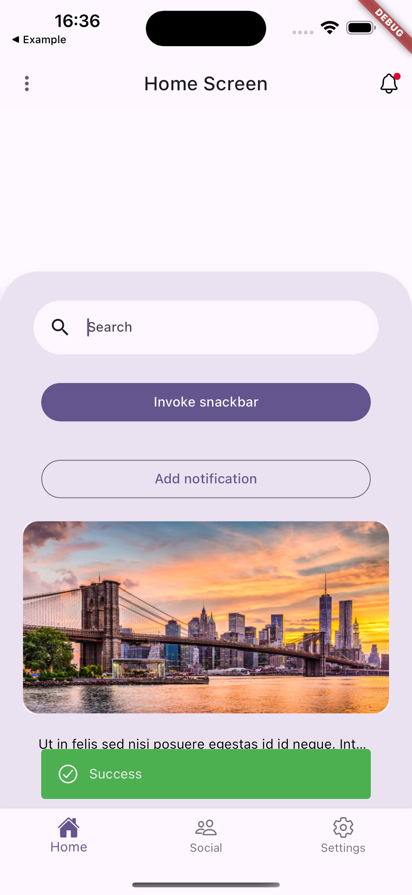

# nx_ui

This package provides ui widgets.

## Features

UI widgets provided in package:

- nx_drawer
- nx_navigation_drawer
- nx_background_card
- nx_background_layer
- nx_empty_screen
- nx_search_text_field
- nx_coming_soon_widget
- nx_expandable_text
- nx_primary_button
- nx_secondary_button
- nx_shimmer_box
- nx_snackbar
- nx_photo_card

## Getting started

Add the package to pubspec:

```yaml
nx_ui:
  git:
    url: https://github.com/sequrify-io/nx_ui.git
    ref: v0.0.18
```

## Usage and description of widgets

### nx_drawer


Example usage:

```dart
import 'package:nx_ui/widgets/nxCustomDrawer.dart';

...
  drawer: NxCustomDrawer(
            sequrifyButton: SequrifyButton(
              onPressed: () {},
            ),
            drawerOptions: {
              [
                'Profile',
                SvgPicture.asset('assets/icons/profile_icon.svg'),
              ]: () => {
                    context.goNamed(
                      'home',
                      pathParameters: {
                        'tab': '0',
                      },
                    ),
                  },
              [
                'Notification',
                SvgPicture.asset('assets/icons/notifications_icon.svg'),
              ]: () => {
                    context.goNamed(
                      'home',
                      pathParameters: {
                        'tab': '1',
                      },
                    ),
                  },
              [
                'Settings',
                SvgPicture.asset('assets/icons/settings_icon.svg'),
              ]: () => {
                    context.goNamed(
                      'home',
                      pathParameters: {
                        'tab': '2',
                      },
                    ),
                  },
            },
          ),
```

You have to provide one required parameter:
final Map<List<dynamic>, Function() drawerOptions
As keys you provide a list where first element is a name of drawer option, and second element is an optional icon that appears next to the name.
As values you need to provide a Function

Additionally you can provide parameters:

final EdgeInsets? padding;
final DrawerHeader? drawerHeader;
final TextStyle? optionTextStyle;
final bool withSignOutOption - default true.
final Function? signOutFunction - function invoked after clicking sign out.
final TextStyle? signOutTextStyle;
final Widget? signOutIcon;
final Widget? sequrifyButton;

### nx_navigation_drawer

Another proposition of drawer, this time NavigationDrawer from Material3.


Example usage:

```dart

    const drawerDestinations = <Destination>[
      Destination('Profile', Icon(Icons.person_2_outlined), Icon(Icons.person_2)),
      Destination('Notifications', Icon(Icons.notifications_outlined), Icon(Icons.notifications)),
      Destination('Settings', Icon(Icons.settings_outlined), Icon(Icons.settings)),
    ];

...
 NxCustomNavigationDrawer(
            sequrifyButton: SequrifyButton(
              onPressed: () {},
            ),
            destinations: drawerDestinations,
            signOutDestination: Destination(
              'Sign out',
              SvgPicture.asset(
                'assets/logout_icon.svg',
                package: 'nx_ui',
              ),
              SvgPicture.asset(
                'assets/logout_icon.svg',
                package: 'nx_ui',
              ),
            ),
            onDestinationSelected: (int index) {
              context.goNamed(
                'home',
                pathParameters: {
                  'tab': '$index',
                },
              );
            },
            selectedIndex: currentTab,
          ),

```

You have to provide one required parameter:
List<Destination> destinations - list of Destination model objects, that are displayed in drawer.

Destination model also comes with nx_ui package:

```dart
class Destination {
  const Destination(
    this.label,
    this.icon,
    this.selectedIcon,
  );

  final String label;
  final Widget icon;
  final Widget selectedIcon;
}

```

It has label, icon and selectedIcon attributes.

Additionaly NxCustomNavigationDrawer takes parameters:

final Function(int)? onDestinationSelected;
final int? selectedIndex;
final List<Destination> destinations;
final Destination? signOutDestination;
final TextStyle? headerTextStyle;
final TextStyle? optionTextStyle;
final Widget? sequrifyButton;
final Color? backgroundColor;
final double? elevation;
final Color? shadowColor;
final Color? surfaceTintColor;
final Color? indicatorColor;
final ShapeBorder? indicatorShape;

### nx_background_card

Resizable background card widget, adjustable to the screen. It goes well with Stack widget.

<p>

</p>

Example usage:

```dart
...
...
child: Stack(
          children: [
            NxBackgroundLayer(
              backgroundColor: Colors.black.withOpacity(0.3),
            ),
            Positioned(
              bottom: 0,
              child: NxBackgroundCard(
                height: 0.5,
                elevation: 20,
                child: Column(
                  mainAxisSize: MainAxisSize.max,
                  mainAxisAlignment: MainAxisAlignment.start,
                  crossAxisAlignment: CrossAxisAlignment.start,
                  children: [
                    NxEmptyScreen(
                      height: 350,
                      context: context,
                      information: const Text('No elements'),
                      color: Colors.white,
                    ),
                    Row(
                      mainAxisSize: MainAxisSize.max,
                      mainAxisAlignment: MainAxisAlignment.start,
                      crossAxisAlignment: CrossAxisAlignment.start,
                      children: [
                        const Spacer(),
                        NxSecondaryButton(
                          text: "Cancel",
                          onPressed: () {},
                          buttonWidth: 155,
                          buttonHeight: 50,
                        ),
                        const Spacer(),
                        NxPrimaryButton(
                          text: "Add",
                          onPressed: () {},
                          buttonWidth: 155,
                          buttonHeight: 50,
                        ),
                        const Spacer(),
                      ],
                    ),
                  ],
                ),
              ),
            ),
          ],
        ),
...
```

NxBackgroundCard takes 8 parameters:

- final Widget child
- final double? height
- final double? width
- final Color? backgroundColor
- final EdgeInsetsGeometry? margin;
- final double? elevation;
- final ShapeBorder? shape;
- final bool isScrollable;

### nx_background_layer

Container widget that works as a background image.

<p>


</p>

Example usage:

```dart
...
drawer: Stack(
        children: [
          GestureDetector(
            onTap: () => context.pop(),
            child: Stack(
              children: [
                NxBackgroundLayer(
                  backgroundColor: Colors.black.withOpacity(0.2),
                ),
              ],
            ),
          ),
          NxCustomDrawer(
            ...)
            ...
        ]
)
...
```

It takes 5 parameters:
final bool fromAssets - by default true. If set to false, then network.image will be used.
final String imagePath - path to the image
final double imageShift - distance from the bottom of the stack
final double imageOpacity - image opacity
final Color? backgroundColor - background color in case when not using image

### nx_empty_screen

Empty customizable widget that can be used e.g. when there's no elements returned in list or grid view.

<p>

</p>

Example usage:

```dart
...
NxBackgroundCard(
                  context: context,
                  height: 0.76,
                  child: nxEmptyScreen(
                    context,
                    const Text('No elements'),
                    Colors.white,
                  ),
                ),
```

It takes 5 parameters:

- Text information - text displayed inside container
- Color color - color of the container
- IconData? icon - icon displayed inside container
- double? height - height of the container
- double? width - width of the container

### nx_search_text_field

Search field widget.

<p>

</p>

Example usage:

```dart
...
 Padding(
                      padding: const EdgeInsets.symmetric(horizontal: 15.0),
                      child: NxSearchTextField(
                        onChanged: (value) {
                          searchString = value.toLowerCase();
                        },
                      ),
                    ),
```

It takes parameters:

final Function(String)? onChanged - function invoked after text field changes
final bool readOnly - indicator if the field is read only or not
final String? searchText - String displayed inside field
final Color? cursorColor - cursor color
final Color? fillColor - text field color
final TextStyle? labelStyle - text field text style
final TextStyle? hintStyle - text field hint text style
final Widget? suffixIcon - custom icon widget
final TextEditingController? controller;
final FocusNode? focusNode;
final double? width;
final double? height;

### nx_coming_soon_widget

This widget can be used as a preview of some features.

Example usage:

```dart
...
  @override
  Widget build(BuildContext context, WidgetRef ref) {
    return const Scaffold(
      body: nxComingSoonPanel(text: 'More info available soon', comingSoonTitle: 'Coming soon'),
    );
  }

```


You have to provide two required parameters:

- required String text - lower text visible on screen
- required String comingSoonTitle - upper text visible on screen

The other parameters you can provide are:

- SvgPicture? svg - svg visible above title text
- TextStyle? textStyleTitle - text style of title text
- TextStyle? textStyleBody - text style of lower text

### nx_expandable_text

This widget can be used when you have a long text and you want to have an option to show dialog to display whole text on scrollable.
Example usage:

```dart
...
  @override
  Widget build(BuildContext context, WidgetRef ref) {
    return const Scaffold(
      body: Center(
        child: Column(
          children: [
            SizedBox(
              height: 100,
            ),
            nxExpandableText(text: 'hellesdfdsfdsfsdffdsdddddddjvfjfdvhfbdjdnfvcdskvjidusbvhdskfncjbdfvdnvkdsmcksdmckdmscjdnvsdvnidsjvdsmkbkmcksmdcjdsbfcdkcmdsjustynadn dsjnfsocmskdfo', buttonText: 'Read more')
          ],
        ),
      ),
    );
  }

```


You have to provide to widget two required parameters:

- required String text - text visible on screen
- required String buttonText - text that invokes dialog after tapping

The other parameters you can provide are:

- Image? icon - your own icon used for closing the dialog that would replace the default icon
- TextStyle? dialogTextStyle - text style inside dialog
- TextStyle? textStyle - text style of text on screen
- TextStyle? buttonTextStyle - text style of button text on screen
- Color? backgroundColor - background color of dialog
- int maxLines - by default it is set to 1, number of lines that can be visible on screen

### nx_primary_button

This widget can be used as a button.
Example usage:

```dart
...
 child: NxPrimaryButton(
                        buttonWidth: MediaQuery.of(context).size.width * 0.8,
                        onPressed: () {
                          NxCustomSnackBar.showErrorSnackBar(context: context, message: 'Error');
                        },
                        text: 'Invoke snackbar',
                      ),

```


You have to provide two required parameters:

- required void Function() onPressed - function that will be invoked after clicking the button
- required String text - text displayed on button

The other parameters you can provide are:

final EdgeInsetsGeometry? margin;
final Color? buttonColor;
final TextStyle? buttonTextStyle;
final double? buttonWidth;
final double? buttonHeight;
final double? buttonElevation;
final double? borderRadius;

### nx_secondary_button

Example usage:

```dart
...
 child: NxSecondaryButton(
                        buttonWidth: MediaQuery.of(context).size.width * 0.8,
                        onPressed: () async {
                          final notification = NotificationEntry(
                            id: '2',
                            createdAt: DateFormat('dd/MM/yyyy').format(DateTime.now()),
                            title: 'New data from New York',
                            description: 'TNew York, often referred to as the "Big Apple," is one of the most iconic cities in the world. Located on the northeastern coast of the United States, it is a bustling metropolis known for its diverse culture, towering skyscrapers, and vibrant atmosphere.',
                            readNotification: false,
                          );
                          notificationList.add(notification);
                          ref.read(notificationsProvider.notifier).update((_) => true);
                          ref.read(notificationListProvider.notifier).update((_) => notificationList);
                          await NotificationService.showNotification(
                            title: 'New data from New York',
                            body: 'TNew York, often referred to as the "Big Apple," is one of the most iconic cities in the world. Located on the northeastern coast of the United States, it is a bustling metropolis known for its diverse culture, towering skyscrapers, and vibrant atmosphere.',
                            payload: 'New data from New York',
                          );
                        },
                        text: 'Add notification',
                      ),

```


You have to provide to widget two required parameters:

- required void Function() onPressed - function that will be invoked after clicking the button
- required String text - text displayed on button

The other parameters you can provide are:

final EdgeInsetsGeometry? margin;
final Color? buttonColor;
final TextStyle? buttonTextStyle;
final double? buttonWidth;
final double? buttonHeight;
final ButtonStyle? buttonStyle;
final double? borderRadius;

### nx_shimmer_box

This widget provides a shimmer animation, it can be displayed during loading.

Example usage:

```dart
...
 @override
  Widget build(BuildContext context, WidgetRef ref) {
    return const Scaffold(body: nxShimmerBox());
  }

```


Parameters you can provide are:

- double width - width of container with shimmer, by default infinity
- double height - height of container with shimmer, by default infinity
- double opacity - opacity of shimmer, by default 1
- Color? color - color of shimmer

### nx_snackbar

This widget provides a custom snackbar.

<p>



</p>

There are three types of snackbar defined:

- success
- error
- warning

You can use showSuccessSnackBar, showErrorSnackBar, and showWarningSnackbar.

Here is example usage:

```dart
...
 nxPrimaryButton(
                      imageColor: Colors.black,
                      onPressed: () {
                        NxCustomSnackBar.showErrorSnackBar(context: context, message: 'Error');
                      },
                      labelText: 'Invoke snackbar',
                    ),

```

You can also customize it to your own type using showCustomSnackBar function.

For parameters you provide:

required BuildContext context - context
required String message - snackbar message
required Color color - snackbar color
IconData? icon - icon on snackbar
int seconds - how long snackbar displays

### nx_photo_card

Card widget that can be used to display e.g.images, in gridView, etc.

Example usage:

```dart
...
const NxPhotoCard(
                      imagePath: 'assets/images/new_york.png',
                    ),
```

It takes parameters:

final String? imagePath;
final double? elevation;
final Widget? child;
final double? height;
final double? width;

## Bugs & features

If you found bug or need a feature add issue on Github or make a PR.
